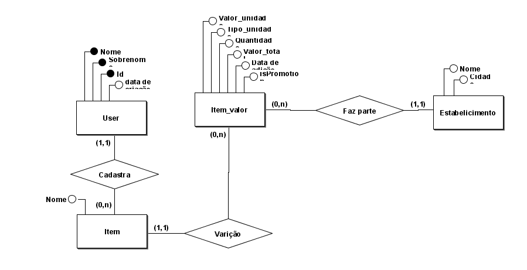

## Cronograma - projeto de fixação de conteúdo para conclusão de semestre.
# Obejtivos
- Criar o mini mundo.
- Modelagem conceitual.
- Modelo logico/Normalização.
- Modelo físico.
- Adicionar triggers para logs, Views para API e procedures. 
- Se conectar a uma Api Restfull com spring boot.
## Restrições
- Deve-se ser feito passo a passo sem pular nenhuma etapa.
- O foco é no banco de dados e não em alguma ORM
- Utilização de LLM restrita apenas para duvidas e não para geração de código ou textos
- Pode ser utilizado qualquer banco relacional 
# Ideia
Criar um banco de dados, onde o usuário pode cadastrar suas compras e gerar uma linha do tempo de seus gastos e dos diferentes preços dos itens que são adquiridos. Como exemplo poderia ser adicionado o item Coca-Cola 2L custando R$10.99 aonde 10 dias depois esse mesmo itens custaria R$8.99, o sistema também deve possibilitar o cadastramento de locais onde ocorreu a compra ou seja o item citado acima possui dois preços com uma certa diferença de tempo, mas também pode ter sido adquirido em dois lugares diferentes.

## Minimundo
Como cliente é importante a identificação de usuários então o sistema deve possuir o cadastro de usuários sendo como identificação o nome, sobrenome e o Id sequencial, o item deve conter características  como o nome do item, data da aquisição, se estava ou não em promoção, o valor que deve poder identificado como unidades ou kg e o local da compra que deve conter o nome do mercado ou estabelecimento.

## Modelo conceitual

## Modelo logico

## Views propostas
- Visualizar todas as variação de itens por estabelecimento deve conter,nomes dos itens e estabelecimentos e estarem 
 organizados por data da ultima para primeira agrupados por itens e estabelecimentos;

- Visualizar quantas variações possuem por estabelecimento e item, deve conter nome do estabelecimento, item e quantidade de variações.

- Visualizar a diferencça entre a maior e menor variação de por item, deve conter nome do item e diferença de varição.
 
- Visualizar a quantidade de variações por estabelecimento junto a primeira e ultima data de adição, deve conter nome do estabelecimento, primeira e ultima data de variação adicionada.

- Visualizar a quantidade de variações por item junto a diferença entre a ultima e a primeira variação
  do item, o maior e menor valor de um item junto das datas primeira variação e ultima, data de maior e menor variação. 
